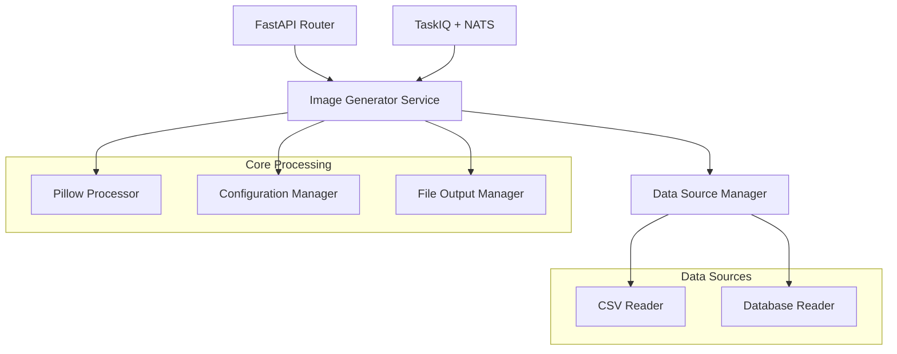

# 设计文档

## 概述

图片生成器模块是OneManage系统中的一个独立功能模块，位于`OneManage/features/image_generator/`目录下。该模块使用Pillow库进行图像处理，支持从多种数据源（CSV文件、数据库）读取文本信息，批量生成透明背景的PNG图片，并最终集成到现有的taskiq + NATS消息队列系统中。

模块采用分层架构设计，遵循OneManage项目的现有架构模式，包含models、schemas、services、routers等标准组件。

## 架构

### 整体架构图



### 分层架构

1. **API层 (routers/)**: 提供HTTP接口和TaskIQ任务接口
2. **服务层 (services/)**: 核心业务逻辑处理
3. **数据层 (models/)**: 数据模型和数据库交互
4. **配置层 (schemas/)**: 请求/响应模型和配置模型

## 组件和接口

### 1. 核心组件

#### PillowProcessor
负责使用Pillow库进行图像生成的核心组件。

```python
class PillowProcessor:
    def __init__(self, config: ImageConfig):
        self.config = config
    
    def generate_image(self, text: str, font_config: FontConfig) -> bytes:
        """生成单张透明背景PNG图片"""
        pass
    
    def batch_generate(self, texts: List[str], font_config: FontConfig) -> List[bytes]:
        """批量生成图片"""
        pass
```

#### DataSourceManager
管理不同数据源的读取操作。

```python
class DataSourceManager:
    def read_csv(self, file_path: str, text_column: str) -> Iterator[str]:
        """从CSV文件读取文本数据"""
        pass
    
    def read_database(self, query: str, connection_config: DatabaseConfig) -> Iterator[str]:
        """从数据库读取文本数据"""
        pass
```

#### ImageGeneratorService
主要业务逻辑服务，协调各个组件。

```python
class ImageGeneratorService:
    def __init__(self):
        self.processor = PillowProcessor()
        self.data_manager = DataSourceManager()
    
    async def generate_from_csv(self, request: CSVGenerationRequest) -> GenerationResult:
        """从CSV生成图片"""
        pass
    
    async def generate_from_database(self, request: DatabaseGenerationRequest) -> GenerationResult:
        """从数据库生成图片"""
        pass
```

### 2. 数据模型 (schemas/)

#### 配置模型

```python
class FontConfig(BaseModel):
    font_path: Optional[str] = None  # 字体文件路径，None使用默认字体
    font_size: int = 24  # 字体大小（像素）
    color: str = "#000000"  # 文字颜色（十六进制）

class ImageConfig(BaseModel):
    width: Optional[int] = None  # 图片宽度，None为自适应
    height: Optional[int] = None  # 图片高度，None为自适应
    padding: int = 10  # 文字周围的内边距
    background_color: str = "transparent"  # 背景颜色

class OutputConfig(BaseModel):
    output_dir: str  # 输出目录
    filename_template: str = "{index}_{text}"  # 文件名模板
    format: str = "PNG"  # 输出格式
```

#### 请求模型

```python
class CSVGenerationRequest(BaseModel):
    csv_file_path: str
    text_column: str
    font_config: FontConfig
    image_config: ImageConfig
    output_config: OutputConfig

class DatabaseGenerationRequest(BaseModel):
    query: str
    text_field: str
    font_config: FontConfig
    image_config: ImageConfig
    output_config: OutputConfig

class TaskIQGenerationRequest(BaseModel):
    data_source: Literal["csv", "database"]
    source_config: Union[CSVGenerationRequest, DatabaseGenerationRequest]
```

#### 响应模型

```python
class GenerationResult(BaseModel):
    success: bool
    total_count: int
    success_count: int
    failed_count: int
    output_files: List[str]
    errors: List[str]
    execution_time: float
```

### 3. API接口 (routers/)

#### HTTP接口

```python
@router.post("/generate/csv", response_model=GenerationResult)
async def generate_from_csv(request: CSVGenerationRequest):
    """从CSV文件生成图片"""
    pass

@router.post("/generate/database", response_model=GenerationResult)
async def generate_from_database(request: DatabaseGenerationRequest):
    """从数据库生成图片"""
    pass

@router.get("/fonts", response_model=List[str])
async def list_available_fonts():
    """获取可用字体列表"""
    pass
```

#### TaskIQ任务接口

```python
@broker.task
async def generate_images_task(request: TaskIQGenerationRequest) -> GenerationResult:
    """异步图片生成任务"""
    pass
```

## 数据模型

### 数据库模型 (models/)

```python
class ImageGenerationJob(SQLModel, table=True):
    __tablename__ = "image_generation_jobs"
    
    id: Optional[int] = Field(default=None, primary_key=True)
    job_name: str
    data_source: str  # "csv" or "database"
    source_config: str  # JSON配置
    font_config: str  # JSON配置
    image_config: str  # JSON配置
    output_config: str  # JSON配置
    status: str = "pending"  # pending, processing, completed, failed
    total_count: Optional[int] = None
    success_count: Optional[int] = None
    failed_count: Optional[int] = None
    error_message: Optional[str] = None
    created_at: datetime = Field(default_factory=datetime.utcnow)
    updated_at: Optional[datetime] = None
    completed_at: Optional[datetime] = None
```

### 配置存储

使用现有的配置系统扩展，在`core/config.py`中添加图片生成相关配置：

```python
class Settings(BaseSettings):
    # ... 现有配置 ...
    
    # 图片生成器配置
    IMAGE_GENERATOR_OUTPUT_DIR: str = "/data/generated_images"
    IMAGE_GENERATOR_DEFAULT_FONT_SIZE: int = 24
    IMAGE_GENERATOR_MAX_BATCH_SIZE: int = 1000
    IMAGE_GENERATOR_SUPPORTED_FORMATS: List[str] = ["PNG", "JPEG"]
```

## 错误处理

### 错误类型定义

```python
class ImageGeneratorError(Exception):
    """图片生成器基础异常"""
    pass

class FontNotFoundError(ImageGeneratorError):
    """字体文件未找到异常"""
    pass

class DataSourceError(ImageGeneratorError):
    """数据源读取异常"""
    pass

class ImageProcessingError(ImageGeneratorError):
    """图像处理异常"""
    pass

class OutputError(ImageGeneratorError):
    """输出文件异常"""
    pass
```

### 错误处理策略

1. **数据源错误**: 记录错误日志，返回详细错误信息
2. **字体加载错误**: 自动降级到系统默认字体
3. **图像处理错误**: 跳过当前项目，继续处理下一项
4. **输出错误**: 检查磁盘空间和权限，提供修复建议
5. **批量处理错误**: 部分失败时继续处理，最终返回成功和失败的统计

## 测试策略

### 单元测试

1. **PillowProcessor测试**
   - 基本图片生成功能
   - 字体加载和渲染
   - 透明背景验证
   - 不同参数组合测试

2. **DataSourceManager测试**
   - CSV文件读取
   - 数据库连接和查询
   - 错误数据处理
   - 大数据量处理

3. **ImageGeneratorService测试**
   - 端到端生成流程
   - 错误处理逻辑
   - 配置验证

### 集成测试

1. **API接口测试**
   - HTTP接口功能验证
   - 请求参数验证
   - 响应格式验证

2. **TaskIQ集成测试**
   - 任务队列集成
   - NATS消息传递
   - 异步处理验证

3. **数据库集成测试**
   - 作业记录存储
   - 状态更新机制
   - 并发处理测试

### 性能测试

1. **批量处理性能**
   - 不同批次大小的处理时间
   - 内存使用情况监控
   - 并发处理能力

2. **资源使用测试**
   - CPU使用率监控
   - 内存泄漏检测
   - 磁盘I/O性能

### 测试数据准备

1. **CSV测试文件**
   - 小数据集（10条记录）
   - 中等数据集（1000条记录）
   - 大数据集（10000条记录）
   - 包含特殊字符的数据

2. **数据库测试数据**
   - 测试表结构创建
   - 多种数据类型测试
   - 空值和NULL处理

3. **字体文件**
   - 系统默认字体测试
   - 自定义字体文件测试
   - 不存在字体文件的错误处理